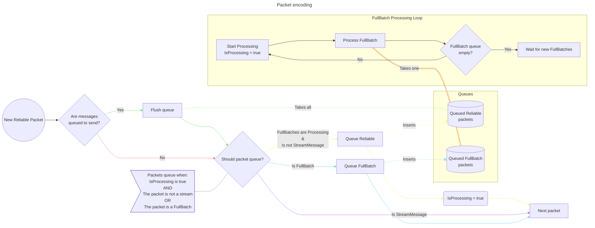

# What causes lag when a user joins?

* The encoding loop gets stopped up by the outgoing full batch.
    - Full batch is enqueued and then JoinStartDelta control is enqueued
    - Full batch can be quite large, which halts encoding loop until it's sent. All queued messages then flush out.
    - This causes everyone in the session to stop moving and is quite disruptive

# How can we solve this?

* Move the full batch to process outside of the encoding loop
* How to ensure order of messages reliably?
    - Detect full batch, queue all subsequent reliable messages until encoding is done
    - Reliable messages

