# 🌊 Outflow: Keep those packets coming!

Outflow is a mod for [Resonite](https://resonite.com) via [ResoniteModLoader](https://github.com/resonite-modding-group/ResoniteModLoader) that aims to mitigate or outright eliminate interruptions in voice, player movements or any streamed data when new users join particularly large sessions.

## Usage
Simply drop the mod into your `rml_mods` folder within the Resonite directory and you're done! This mod should work on both Headless clients and normal clients. Outflow is only required by the host of the world to work for everyone in the session.

# What causes lag when a user joins?

* The encoding loop gets stopped up by what's called a 'FullBatch'
    - A FullBatch is a message that contains the entirety of the session, these are quite large
    - These batches take quite a lot of time to encode (Up to multiple seconds in some cases!)
    - This stops any messages from being sent until a FullBatch is completely encoded and transmitted
    - In sum, everyone in the session stops moving/talking, and is quite disruptive

# How do we solve this?

* Move the StreamMessage processing to it's own exclusive thread
    - This ensures that streams (aka the stuff that carries your voice and movement data) don't get interrupted by a FullBatch encode
    - All other reliable packets stay on the default queue and are unaffected

# How does it work?

I'm glad you didn't ask! Here's a massive MermaidJS diagram for your viewing pleasure:

```mermaid
---
title: How packets are processed normally
---
%%{ init: { 'flowchart': { 'curve': 'monotoneX' } } }%%
graph LR
    style Queue fill:#48392A,stroke:#E69E50,stroke-width:2px
    subgraph Queue[Queue packets to send]
    direction LR
        NewPacket[New packet to send]
        Store[Store in queue]
        PacketQueue[(Packet Queue)]

        
        NewPacket --> Store --x PacketQueue
    end


    style ProcessLoop fill:#484A2C,stroke:#F8F770,stroke-width:2px
    subgraph ProcessLoop[Packet Processing Loop]
        While[While queue isn't empty]
        Take[Take one from queue]
        Encode[Wait for encode]
        Transmit(Transmit packet 📡)


        While --> Take
        Take --> Encode --> Transmit --> While
        PacketQueue -.->|Takes one| Take
        linkStyle 6 stroke:#E69E50,stroke-width:4px
    end
```

```mermaid
---
title: How packets are processed with Outflow
---
%%{ init: { 'flowchart': { 'curve': 'monotoneX' } } }%%
graph LR
    style Queue fill:#284C5D,stroke:#61D1FA,stroke-width:2px
    subgraph Queue[Queue packets to send]
    direction LR
        PacketQueue[(Packet Queue)]
        StreamQueue[(Stream Packet\nQueue)]


        NewPacket[New packet to send]
        Store[Store in normal queue]
        IsStream{Is StreamMessage?}
        StoreStream[Store in stream queue]

        
        NewPacket --> IsStream
        IsStream -->|No| Store --x PacketQueue
        linkStyle 1,2 stroke:#FF7676

        IsStream -->|Yes| StoreStream --x StreamQueue
        linkStyle 3,4 stroke:#59EB5C
    end



    style ProcessLoop fill:#484A2C,stroke:#F8F770,stroke-width:2px
    subgraph ProcessLoop[Packet Processing Loop]
        While[While queue isn't empty]
        Take[Take one from queue]
        Encode[Wait for encode]
        Transmit(Transmit packet 📡)


        While --> Take
        Take --> Encode --> Transmit --> While
        PacketQueue -.->|Takes one| Take
        linkStyle 9 stroke:#E69E50,stroke-width:4px
    end



    style StreamProcessLoop fill:#492F64,stroke:#BA64F2,stroke-width:2px
    subgraph StreamProcessLoop[Stream Packet Processing Loop]
        WhileStream[While queue isn't empty]
        TakeStream[Take one from queue]
        EncodeStream[Wait for encode]
        TransmitStream(Transmit packet 📡)


        WhileStream --> TakeStream
        TakeStream --> EncodeStream --> TransmitStream --> WhileStream
        StreamQueue -.->|Takes one| TakeStream
        linkStyle 14 stroke:#BA64F2,stroke-width:4px
    end
```

# Why isn't this in the game by default?

I get this question a lot about some of my mods, so I want to go a little bit into detail about why it seems like modders can do all of these amazing things when the YDMS Team can't.

**Mods do not care.**

What I mean by this, is that they don't care about the philosophy behind why something is built. Imagine you have an office building and you want to run a long network cable to the other side. If you own the building, you can contract a bunch of workers to carefully route the wires in such a way that is out of the way, and is easily accessible if they need to run more networking to other areas of the building. As a mod-maker, you don't own this building. You can't hire a bunch of workers so what you end up doing is either routing a bunch of cables all over the place where people can trip. You use far more cabling than you need, drill holes in the walls to get it to the next room, or completely tear them down to get the cable where you want it to go. Imagine taking a bulldozer to your bedroom to connect to a router located in your kitchen.

All this is to say that just because a mod can do it, doesn't mean it's the way it should be done. Modding isn't bad (it's actually really good for a platform's longevity it turns out), but it's not the way a game should be developed officially. The YDMS Team work very hard at giving us a stable foundation to base our wacky inventions off of.

You can either use a bulldozer, or recognize why a wall is there in the first place.
  

    
        💙💚 Feel free to support me via <a href="https://paypal.me/BlueCyro">PayPal</a>
    

